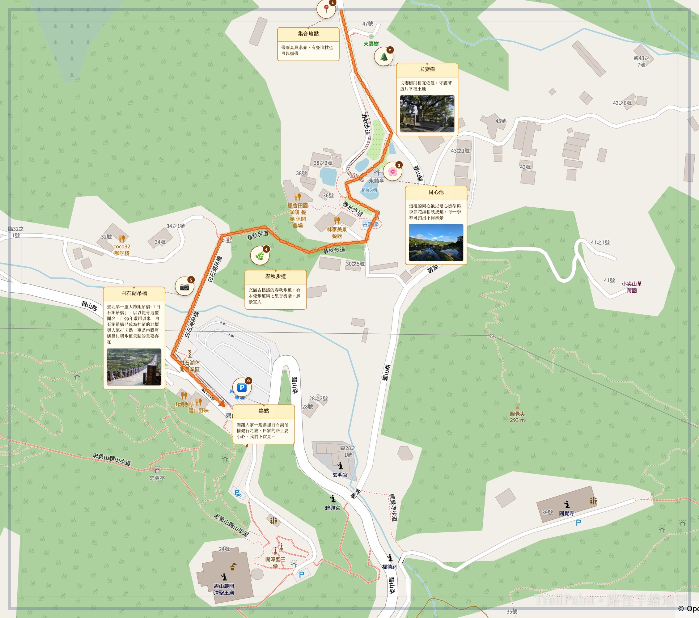

# TrailPaint トレイルペイント

[中文](README.md) | [English](README.en.md) | 🌐 [アプリを開く](https://notoriouslab.github.io/trailpaint/trailpaint-ja.html)

> 一般的な地図を、美しい教育用・ガイド用エコロジーマップに素早く変換

[](LICENSE)
[](#)

---

## これは何？

TrailPaint トレイルペイントは**インストール不要、ブラウザだけ**で使える手描き風マップ作成ツールです。



Google Maps / OpenStreetMap / Apple Maps のスクリーンショットをアップロードするだけで、数分で以下を含むマップを作成できます：

- 🟠 **手描き風ルート** — 点線＋矢印、一目で方向がわかる
- 📍 **スポットカード** — ドラッグ可能、名前・説明・現地写真付き
- 🩹 **カバーアップ機能** — 地図上の広告や不要な情報を隠す
- 🎨 **水彩フィルター** — ワンクリックで柔らかいトーンに
- 💾 **高解像度出力** — 印刷対応の PNG エクスポート

## 誰のため？

| 対象 | 用途 |
|------|------|
| 🌲 国立公園、林務局、自然保護区 | 案内板、ガイドブック挿絵 |
| 🦋 エコツーリズム業者、ガイド | 旅程マップ、カスタムガイド |
| 🎒 登山クラブ、環境教育 NGO、学校 | 教材、イベントマップ |
| 🏡 コミュニティ組織、トレイル開拓者 | コミュニティガイド、トレイル説明 |

## クイックスタート

**オンライン版（推奨）**

URLを開くだけ — インストール不要：

```
https://notoriouslab.github.io/trailpaint/trailpaint-ja.html
```

**オフライン版**

[`trailpaint-ja.html`](trailpaint-ja.html) をダウンロードしてブラウザで開くだけ。**インターネット不要。**

> ⚠️ iOS では「ファイル」アプリから直接開くと Safari のセキュリティ制限を受ける場合があります。オンライン版をご利用ください。

## 使い方

```
1. アップロード → Google Maps 等のスクリーンショットをアップロード
2. ルート     → マップをクリックしてポイントを配置、「ルート完成」を押す
3. スポット   → クリックでマーカーを配置、名前・説明・写真を入力
4. カバー     → ドラッグで隠したいエリアを選択
5. 出力       →「出力」ボタンで高解像度 PNG を取得
```

## 機能一覧

| 機能 | 説明 |
|------|------|
| **ルート描画** | クリックでポイント配置、手描き風点線＋矢印で自動接続。複数ルート対応 |
| **スポットマーカー** | 番号付きマーカー、タイトルカード、説明テキスト、写真添付 |
| **カードドラッグ** | 説明カードを自由にドラッグして配置 |
| **エリアカバー** | 広告や不要テキストを隠す。3つのスタイル（フロスト／ソフト／ペーパー） |
| **水彩フィルター** | ワンクリックでパステルトーン |
| **高解像度出力** | フルサイズ PNG、印刷対応 |
| **プロジェクト保存** | JSON ファイルに保存、後で読み込んで編集続行 |
| **元に戻す／やり直し** | Ctrl+Z / Cmd+Z 対応 |
| **デスクトップズーム** | スクロールホイールでカーソル中心にズーム |
| **透かし切替** | 出力画像の「TrailPaint」透かしをON/OFF |
| **21種アイコン** | 生態系（植物、鳥、昆虫…）＋施設（トイレ、駐車場、救急…） |
| **ゼロインストール** | 単一HTMLファイル、ブラウザで即使用、バックエンド不要 |

## ライセンス

GPL-3.0 License — 自由に使用・改変可能。派生作品も GPL-3.0 でオープンソース化が必要。**クローズドソースの商用利用不可。**

---

*TrailPaint は台北霊糧堂の公園生態探索コースとプロの屋外エコロジーガイドのニーズからインスピレーションを得ました。より多くの人が美しい自然教育マップを簡単に作成できることを願っています。🌿*
