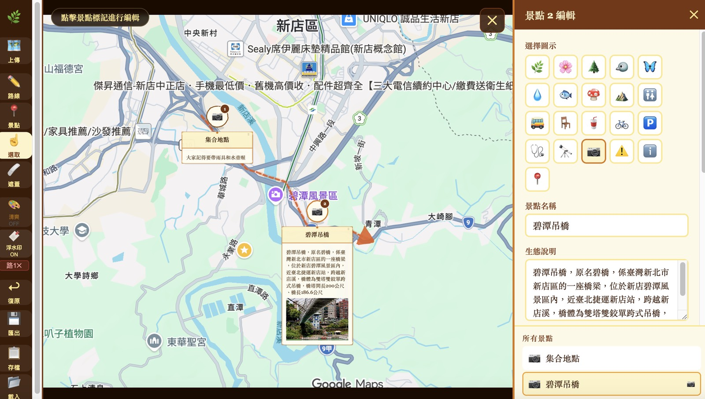
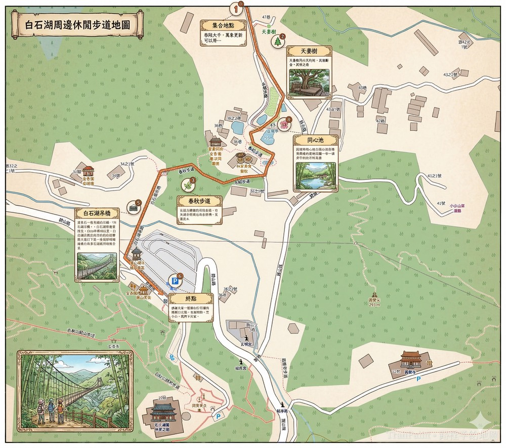

# TrailPaint 路小繪

[English](README.en.md) | [日本語](README.ja.md) | 🌐 [English App](https://notoriouslab.github.io/trailpaint/trailpaint-en.html) | [日本語 App](https://notoriouslab.github.io/trailpaint/trailpaint-ja.html)

> 把一般的地圖，快速變成漂亮的教育性／導覽性生態地圖

[](LICENSE)
[](#)

---

## 這是什麼？

TrailPaint 路小繪 是一款**零安裝、純瀏覽器**的手繪地圖製作工具。


上傳一張 Google Maps / Openstreet Map / Apple Maps截圖，幾分鐘內就能自己動手產出一張帶有：

- 🟠 **手繪風格路線** — 虛線 + 箭頭，一眼看懂走向
- 📍 **景點標記卡片** — 可拖動位置，含名稱、生態說明、還能置入現場照片！
- 🩹 **遮蓋功能** — 蓋住地圖上不想呈現的商業資訊或廣告
- 🎨 **清爽濾鏡** — 一鍵讓底圖變成柔和的水彩風格
- 💾 **高解析度匯出** — PNG 直接印刷或分享

## 適合誰用？

| 族群                      | 用途          |
| ----------------------- | ----------- |
| 🌲 國家公園、林務局、自然保留區       | 解說牌、導覽手冊配圖  |
| 🦋 生態旅遊業者、民宿、導覽解說員      | 行程地圖、客製化導覽圖 |
| 🎒 登山社團、自然教育 NGO、學校環境教育 | 課程教材、活動地圖   |
| 🏡 里山倡議、社區營造、獨立步道開拓者    | 社區導覽、步道說明   |

## 快速開始

**線上版（推薦）**

直接打開網址，不需要安裝任何東西：

```
https://notoriouslab.github.io/trailpaint/
```

**離線版**

下載 [`trailpaint.html`](trailpaint.html) 單一檔案，用瀏覽器開啟即可使用，**完全不需要網路**。

> ⚠️ iOS 直接從「檔案」App 開啟可能受 Safari 安全限制。建議使用線上版，或透過本機伺服器開啟。

## 使用方式

```
1. 上傳  →  截一張 Google Maps / Openstreet Map / Apple Maps 畫面上傳
2. 路線  →  點擊多個點描繪路徑，完成後按「完成路線」
3. 景點  →  點擊地圖放置編號標記，填入名稱、說明、照片
4. 遮蓋  →  拖曳選取要蓋住的區域
5. 匯出  →  按「匯出」取得高解析度 PNG，可直接印刷
```



**手機 / 平板手勢支援**

| 手勢         | 功能            |
| ---------- | ------------- |
| 單指點擊       | 放置路線點 / 景點標記  |
| 長按地圖       | 快速新增景點（650ms） |
| 單指拖曳（選取模式） | 平移地圖          |
| 雙指捏合       | 縮放地圖          |
| 拖曳說明卡片     | 移動卡片位置        |
|            |               |

## 功能一覽

| 功能         | 說明                                  |
| ---------- | ----------------------------------- |
| **路線繪製**   | 點擊地圖描點，自動連成手繪風虛線 + 箭頭，支援多條路線        |
| **景點標記**   | 放置編號圓形標記，附帶名稱卡片、生態說明文字、現場照片         |
| **卡片拖曳**   | 景點說明卡片可自由拖曳到不擋路的位置                  |
| **區域遮蓋**   | 框選地圖上的商業廣告或不相關文字，三種遮蓋風格可選（磨砂／柔邊／紙紋） |
| **清爽濾鏡**   | 一鍵將底圖轉為淡雅水彩風，降低對比、柔化色調              |
| **高解析匯出**  | 輸出原始尺寸 PNG，可直接印刷或分享                 |
| **專案存檔**   | 存成 JSON 檔案，下次載入可完整繼續編輯（含底圖與照片）      |
| **復原／重做**  | Ctrl+Z / Cmd+Z 支援，所有編輯操作都可回退        |
| **桌面縮放**   | 滑鼠滾輪縮放，向游標位置 zoom in/out            |
| **浮水印開關**  | 匯出圖片的「TrailPaint」浮水印可自由關閉           |
| **21 種圖示** | 生態（植物、鳥類、昆蟲…）+ 設施（廁所、停車、急救…）        |
| **零安裝**    | 單一 HTML 檔案，瀏覽器開啟即用，不需要後端或網路         |

## 景點圖示

內建 21 種生態 × 設施圖示：

🌿 植物 🌸 花卉 🌲 樹木 🐦 鳥類 🦋 昆蟲  
💧 水域 🐟 魚類 🍄 菌類 ⛰️ 岩石  
🚻 廁所 🚌 站牌 🪑 休憩 🥤 餐廳 🚲 腳踏車  
🅿️ 停車 🩺 急救 🔭 觀景 📷 拍照 ⚠️ 注意 ℹ️ 說明 📍 標記

## 技術架構

- **前端**：Preact（React compat mode）+ 純 Browser API（無後端、無資料庫）
- **地圖渲染**：SVG overlay + Canvas export
- **手繪效果**：Canvas pixel manipulation（desaturation + grain + vignette）
- **路線遮蓋**：Canvas clipping + Gaussian blur
- **離線支援**：單一 HTML 檔案，Preact UMD 內嵌

## 開發

```bash
git clone https://github.com/notoriouslab/trailpaint.git
cd trailpaint

# 直接開啟（無需 build）
open trailpaint.html

# 或啟動本機伺服器（iOS 開發建議）
python3 -m http.server 8080
```

原始碼直接寫在 `trailpaint.html` 中，不需要 build 工具。

## 已知限制

- iOS 直接開啟本機 HTML 檔案時，JavaScript 排程可能受限
- 景點照片使用 `URL.createObjectURL()`，關閉分頁後釋放
- 匯出時照片需等待 decode，大尺寸圖片可能需要 1–2 秒

## 假如想要更像手工繪圖的風格

可以將 TrailPaint 路小繪 產生的圖檔，扔給 Chatgpt / Google Gemini 之類的工具，下提示詞「製作一個漫畫風格的地圖」，就可以產生類似手工繪圖的風格地圖囉～



## 貢獻

歡迎 PR 和 Issue！特別期待：

- [ ] 更多手繪風格主題（森林、海洋、山岳）
- [ ] 多語言支援（日文等介面）
- [ ] 景點說明匯出為附頁 PDF
- [ ] 匯出 GeoJSON / KML 格式

## 授權

GPL-3.0 License — 自由使用與修改，衍生作品必須同樣以 GPL-3.0 開源。**不得閉源商用。**

---

*TrailPaint 路小繪 的原型由台北靈糧堂致福益人學苑_公園生態探索、專業戶外生態導覽需求啟發，希望讓更多人能輕鬆製作美麗的自然教育地圖。🌿*
