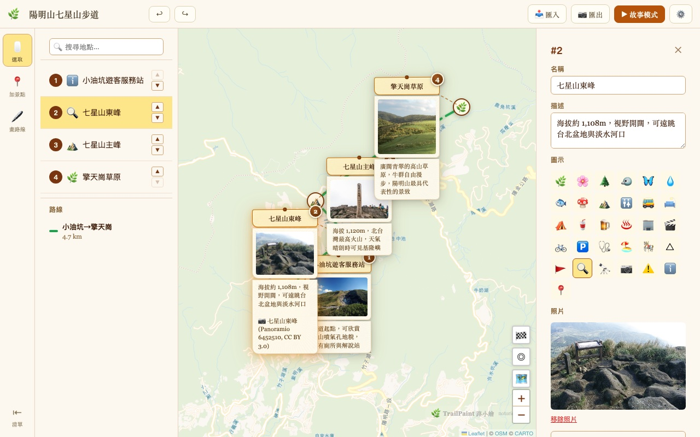
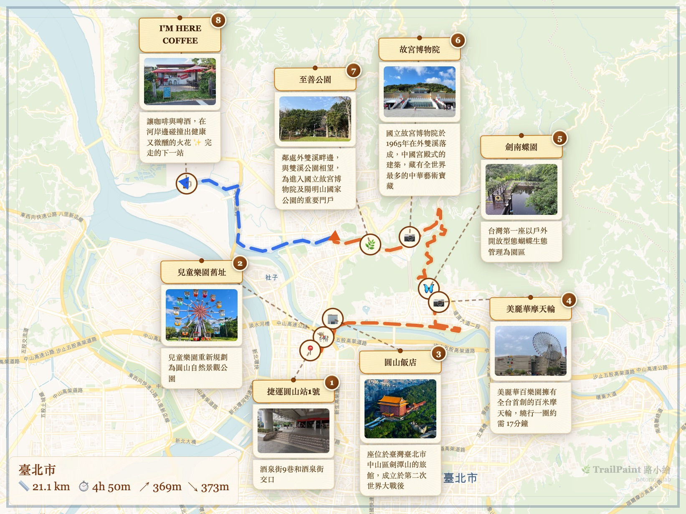
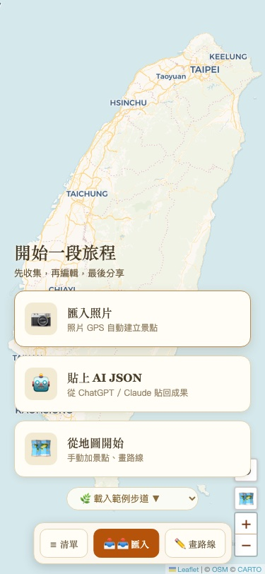
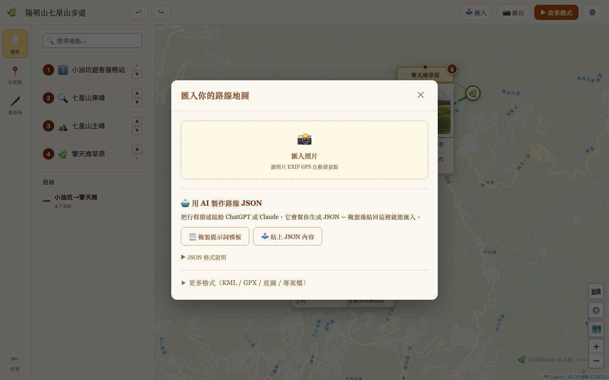
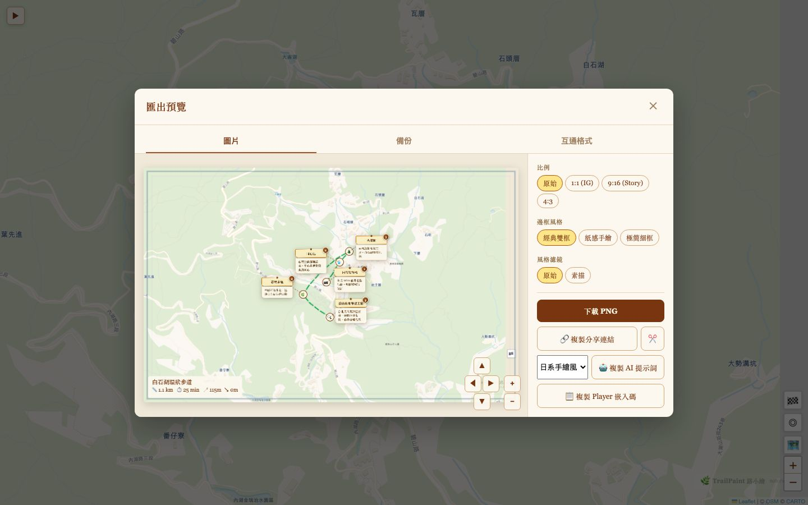
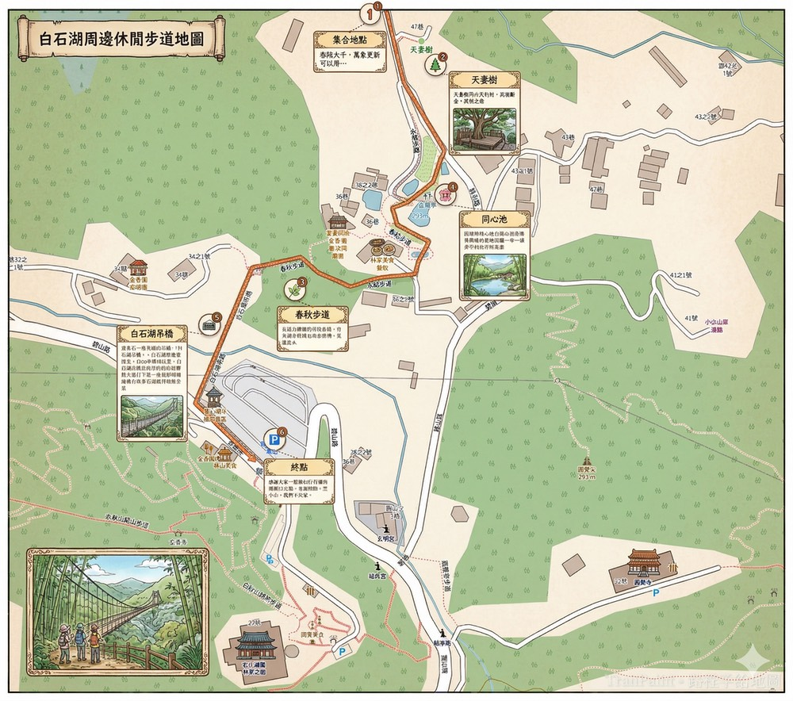
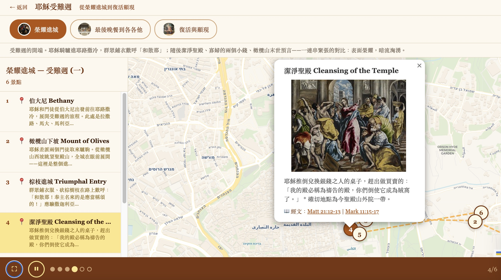

# TrailPaint 路小繪

[English](README.en.md) | [日本語](README.ja.md)

> **手繪風路線地圖工具** — 把一趟旅程變成一張會說故事的插畫地圖。零後端、PWA 可裝機、三語自動偵測。

[](https://github.com/notoriouslab/trailpaint/releases)
[](LICENSE)
[](https://www.typescriptlang.org/)
[](https://trailpaint.org/features/install/)
[](https://trailpaint.org/app/)

**[立即使用 →](https://trailpaint.org/app/)** · **[探索故事地圖 →](https://trailpaint.org/stories/)** · **[Story Player →](https://trailpaint.org/app/player/)** · **[PWA 安裝 →](https://trailpaint.org/features/install/)**



---

## 這是什麼

TrailPaint 的使用節奏是三步：**先收集，再編輯，最後分享**。

1. **收集** — 手機拍完照直接匯入（EXIF GPS 自動建景點），或把行程描述丟給 ChatGPT / Claude 生成 JSON 貼回來
2. **編輯** — 桌機上排順序、補文字、畫路線、隱藏雜線、疊歷史地圖
3. **分享** — 匯出 IG-ready 插畫圖、短網址、或嵌入網頁的自動導覽播放器

| 特色 | 說明 |
|------|------|
| 📷 **照片直匯** | EXIF GPS 自動建景點、按拍攝時間排序；多日行程「連結景點」自動每天一條路線 |
| 🤖 **AI 協作** | 內建提示詞模板，LLM 生成行程 JSON 一鍵匯入，並自動從 Wikimedia Commons 補圖 |
| ⏱ **時空敘事** | 年代滑桿 + 中研院歷史地圖疊加 + 自動導覽故事 |
| 🖼️ **多種輸出** | PNG（IG / 部落格）/ 短網址 / iframe 嵌入 / GPX·KML·GeoJSON 互通 |
| 🔐 **隱私優先** | 零後端、資料全在瀏覽器、可離線使用 |



---

## 快速開始

開啟 [trailpaint.org/app/](https://trailpaint.org/app/)，首屏三張卡直接選：



- **📷 匯入照片** — 選 20 張旅途照片，GPS 自動落點、時間自動排序，一分鐘成圖
- **🤖 貼上 AI JSON** — 複製提示詞給 ChatGPT / Claude，把生成的 JSON 貼回來
- **🗺️ 從地圖開始** — 手機點地圖即可加景點（免切模式），桌機用左側工具列；也可先載入範例路線試玩

做完點「匯出」選比例與樣式，下載 PNG 或產生短網址分享。

---

## 三種建立方式

### 📷 從照片自動建

拍照（含 EXIF GPS）→ 拖進 TrailPaint → 自動抓座標、按拍攝時間排序、反向地理編碼補地名。支援 iPhone HEIC / Android JPEG；無 GPS 的照片會依時間鄰近插值落點，再拖到準確位置即可。**多日行程按「連結景點」會自動每天生成一條路線**，不想露出的路線可個別隱藏（Player、圖片與 GeoJSON 匯出同步排除）。

### 🤖 用 AI 生成

匯入視窗內建提示詞模板：貼給 ChatGPT / Claude 描述行程 → AI 生成 JSON → 貼回匯入。可勾選「自動補圖」從 Wikimedia Commons 抓授權照片（含 CC 署名）。適合行程規劃、歷史或虛構題材。

### 🗺️ 手動繪製

搜尋地點、加景點、畫手繪風路線。手機上點地圖任意處即彈出「在此加景點」，桌機有完整工具列與屬性面板。



**支援匯入格式：** 照片（EXIF）、GPX（登山 App）、KML（Google My Maps）、GeoJSON、.trailpaint 備份檔、截圖作為底圖

---

## 輸出與分享

| 形式 | 用途 |
|------|------|
| **PNG 圖片** | 1:1（IG feed）/ 9:16（Story）/ 4:3 / 原始比例；3 種邊框 × 2 種濾鏡 |
| **短網址** | 照片跟著走、OG 預覽自動用封面（Cloudflare Workers，TTL 90 天） |
| **iframe 嵌入** | 貼進 WordPress、Notion、Substack，變成互動播放器 |
| **.trailpaint 備份** | 完整專案檔，換機或重灌時匯入恢復 |
| **GeoJSON / KML** | 給 geojson.io、Google My Maps、Google Earth 等工具（純地理結構） |



另外可複製 **AI 風格化提示詞**（日系手繪 / 藏寶圖 / 療癒卡通 / 極簡線條），把匯出圖丟給 ChatGPT / Gemini 生成真正的手繪插畫：



---

## Story Player：讓地圖說故事

**[Story Player](https://trailpaint.org/app/player/)** 把靜態地圖變成自動導覽：逐點 fly-to、照片與說明卡展示、背景音樂、全螢幕模式，適合展場、教學投影與網頁嵌入。

- **⏱ 年代滑桿** — 拖動即 cross-fade 切換歷史底圖（中研院西漢/唐/南宋/元/明 + 台灣 1897/1921/1966 + AD 200 羅馬），景點依年代漸隱
- **📚 合輯** — 多個故事段落綁成一個播放器，可依故事順序或跨故事年代排序
- **📮 明信片** — 每個景點一鍵生成 1080×1080 方圖（地圖 + 景點卡 + 年代印章）

精選故事地圖（[全部 →](https://trailpaint.org/stories/)）：

- **台灣宣教士腳蹤** — 馬偕、巴克禮等人的在台路線，疊 1897 日治地圖
- **耶穌受難週** — 12+ 聖經地點、古典畫作、YouVersion 經文連結
- **保羅宣教三次旅行** — 34 景點，AD 46-62 地中海
- **絲路 2000 年** — 張騫 → 玄奘 → 馬可波羅，同一條走廊三段足跡
- **裨海紀遊** — 郁永河 1697 台灣採硫之旅，疊清代與日治歷史地圖



教會場景另有 [`/church/`](https://trailpaint.org/church/) 落地頁（主日學、週報、靈修嵌入示範）。

---

## 技術

| 層級 | 技術 |
|------|------|
| **前端** | Vite + React 19 + TypeScript 5（strict）；`core/`（邏輯）· `map/`（Leaflet 層）· `player/`（獨立入口）分層 |
| **地圖** | Leaflet + react-leaflet + protomaps-leaflet；Protomaps 向量（多語標籤）/ OSM / OpenTopoMap / Esri 衛星圖磚 |
| **狀態** | Zustand + zundo（undo/redo） |
| **匯入匯出** | exifr + ExifReader（EXIF）、@tmcw/togeojson（KML）、html-to-image + Canvas（輸出） |
| **地理服務** | Photon（搜尋/反向編碼，主）+ Nominatim（備援）+ Open-Meteo（海拔） |
| **歷史地圖** | 中研院 [gis.sinica.edu.tw](https://gis.sinica.edu.tw) 圖磚服務 |
| **分享後端** | Cloudflare Workers + KV（唯一的伺服器元件，僅存短網址） |
| **PWA** | vite-plugin-pwa + Workbox 離線支援 |

AI / Agent 整合：[`llms.txt`](https://trailpaint.org/llms.txt) · [`agent-card.json`](https://trailpaint.org/.well-known/agent-card.json) · [專案 JSON Schema](https://trailpaint.org/schemas/project-v3.schema.json)

### 開發

```bash
cd online
npm install
npm run dev        # 開發伺服器（:5173）
npm run build      # 打包到 ../app/
npm test           # vitest
```

Cloudflare Worker 程式碼在 [`cloudflare/`](./cloudflare/)，部署方式見該目錄 README。

---

## 貢獻與分享

歡迎 Bug 回報（含複現步驟）、功能建議、文件改進與程式碼 PR。

用 TrailPaint 做了滿意的地圖？開 [Issue](https://github.com/notoriouslab/trailpaint/issues) 分享你的 `.trailpaint` 專案檔與故事，優秀作品會展示在 [`/stories/`](https://trailpaint.org/stories/)。

---

## 免責聲明

TrailPaint 是**路線記錄與分享工具，不是導航軟體**。距離、海拔等數據為自動推算，戶外活動請以現場實際狀況為準；底圖資料來自 OpenStreetMap / Protomaps 等第三方服務。

## 授權

**GPL-3.0** — 自由使用、修改、衍生創作；衍生作品須同樣開源。詳見 [LICENSE](LICENSE)。

---

*TrailPaint 路小繪的原型由台北靈糧堂致福益人學苑公園生態探索、專業戶外生態導覽需求啟發。🌿*
